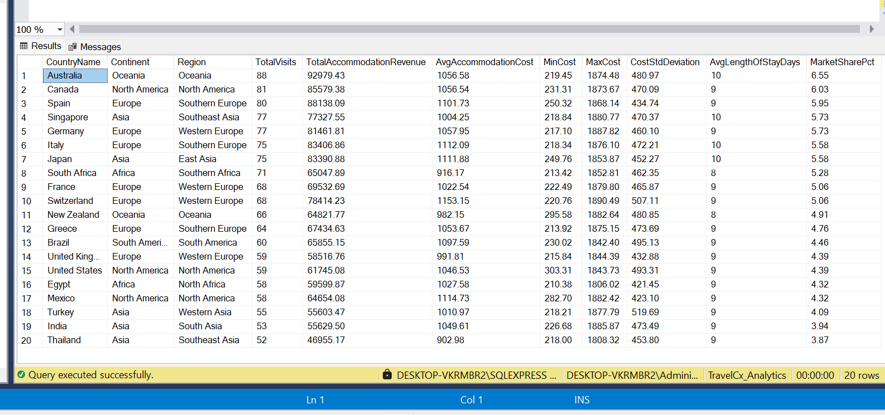

# Destination Performance Analysis - Travel CX

## Overview

This SQL analysis examines destination performance metrics for Travel CX, a travel company with 3 years of data (2023-2025) covering 500 travelers from 20+ countries.

## Analysis Description

This SQL query analyzes destination performance for the Travel CX database by calculating key metrics such as total visits, accommodation revenue, cost statistics (including standard deviation for price volatility), average length of stay, and market share. It groups the results by country, continent, and region, focusing only on completed bookings with at least 5 visits to highlight top-performing locations and pricing trends.

##  Query Results

## Key Metrics Analyzed

- **Total Visits**: Number of completed trips per destination
- **Accommodation Revenue**: Total and average spending per country
- **Cost Statistics**: Min, max, and standard deviation of accommodation costs
- **Length of Stay**: Average duration travelers spend in each destination
- **Market Share**: Percentage of total traffic each destination captures

##  Tools Used

- **SQL Server** - Data querying and statistical analysis
  

##  SQL Query

The analysis uses advanced SQL functions including:
- Aggregate functions (`SUM`, `AVG`, `MIN`, `MAX`)
- Statistical functions (`STDEV`)
- Date functions (`DATEDIFF`)
- Filtering and grouping for meaningful insights
