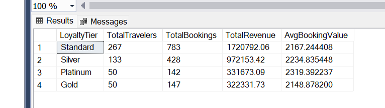

# TravelCX Customer Lifetime Value Analysis

##  Project Overview
Analysis of customer lifetime value segmented by loyalty tiers to identify high-value customer segments and drive retention strategies.

##  Objective
- Identify which loyalty tiers generate the most revenue
- Calculate average booking values across customer segments
- Provide insights for targeted marketing strategies

##  Tools Used
- SQL Server (T-SQL)

##  Key Metrics Analyzed
- Total travelers per loyalty tier
- Total booking count
- Total revenue from completed bookings
- Average booking value per tier

##  SQL Techniques Used
- Aggregate functions (COUNT, SUM, AVG)
- CASE statements for conditional logic
- LEFT JOIN for data combination
- GROUP BY for segmentation
- DISTINCT for accurate counting

##  Key Insights & Business Recommendations
  Standard Tier is the Revenue Driver:
The Standard loyalty tier generates the highest total revenue ($1.72M), accounting for approximately 52% of total revenue.
Recommendation: Focus retention strategies on Standard customers to maintain this revenue baseline.
Silver Tier Shows High Engagement:
Silver travelers have the highest booking frequency (approx. 3.2 bookings per traveler), higher than even Gold or Platinum tiers.
Recommendation: Silver customers are highly engaged; target them with "Upgrade to Gold" campaigns to increase their lifetime value.
Platinum Customers Spend More Per Trip:
While they have fewer total bookings, Platinum customers have the highest Average Booking Value ($2,319).
Recommendation: Analyze what Platinum customers are buying (e.g., business class, longer trips) and offer similar premium packages to Gold/Silver customers.
Consistent Booking Values:
The average booking value is relatively stable across all tiers (ranging from ~$2,148 to ~$2,319).
Insight: Loyalty status drives volume (number of trips) more than the cost of individual trips.
###  Query Results

## 📁 Files
- `Travelcx-Customer lifetime value.sql` - SQL query for the analysis
